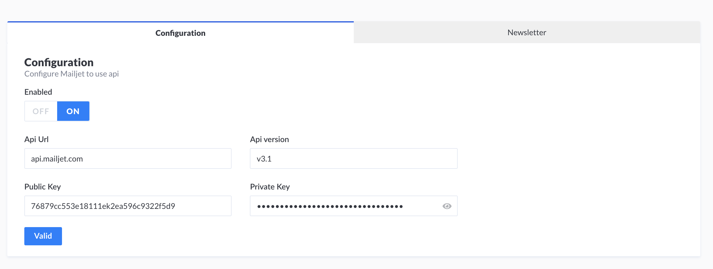
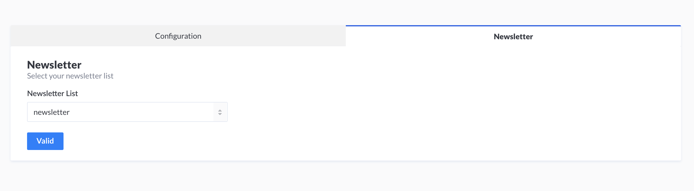

# Strapi plugin mailjet

Mailjet strapi plugin offres Mailjet connection api with parameters from strapi admin and features like subcribe, unsubscribe or remove a contact from a contact list.

## How to use it ?
Easy !

Add it in your package.json dependencies of your project.

From npm :
```
npm install -s @symbol-it/strapi-plugin-mailjet
```


From github :

```
"dependencies": {
    ...
    "strapi-plugin-mailjet": "Symbol-it/strapi-mailjet#master
    ...
}
```


If you want to start your project with your mailjet configuration before the application starts,
use bootstrap function [#doc](https://strapi.io/documentation/v3.x/concepts/configurations.html#bootstrap).
You can use configuration service with update method to do it.

You can also configure mailjet from strapi admin. ;)

The first block is made to configure your mailjet api.



The second to choose your newsletter's list.



## Example of use 

I want to add or remove a contact from my newsletter list when my user wants to subscribe or unsubscribe.

To do it, i add a `User.js` in `extensions/users-permissions/models/` and i create 2 lifecycles : `afterCreate` and `afterUpdate`.

```
module.exports = {
    lifecycles: {
        async afterCreate(result, params, data) {
            ...
        },

        async afterUpdate(result, params, data) {
            ...
        },
    }
};
```

For the first one, i want to add my contact if my mailjet plugin is enabled and if my user wants to subscribe :

```
async afterCreate(result, params, data) {
    const {isSubscriber, email, lastname, firstname} = result;
    const config = await strapi.plugins.mailjet.services.config.get();
    if (config.enabled && isSubscriber === true) {
        const username = lastname + ' ' + firstname;
        await strapi.plugins.mailjet.services.contact.subscribe(email, username, config.newsletterList);
    }
},
```

For the last one, i want to add or remove my contact if mailjet plugin is enabled and if my user subscribe or unsubscribe to the newsletter :

```
async afterUpdate(result, params, data) {
    const {isSubscriber, email, lastname, firstname} = result;
    const config = await strapi.plugins.mailjet.services.config.get();
    if (config.enabled) {
        if (isSubscriber === true) {
            const username = lastname + ' ' + firstname;
            await strapi.plugins.mailjet.services.contact.subscribe(email, username, config.newsletterList);
        } else {
            await strapi.plugins.mailjet.services.contact.remove(email, config.newsletterList);
        }
    }
},
```